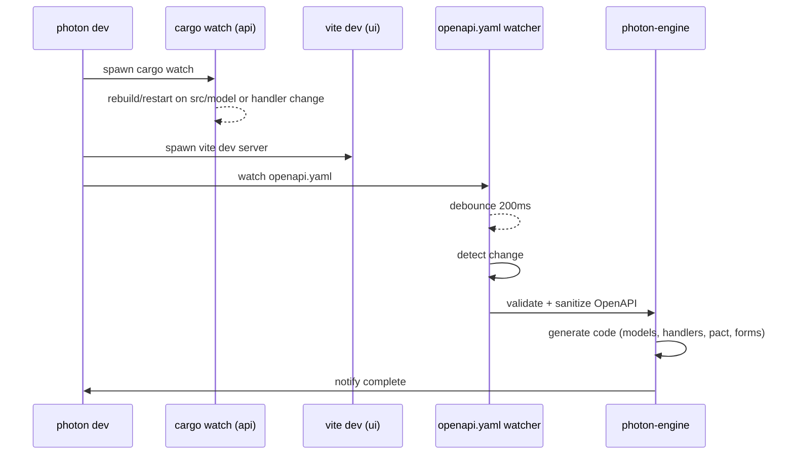

# 🔁 Photon Runtime Execution Model (`photon dev`)

## 🧭 Purpose

Enable full-stack, contract-first development with live-reload and spec-driven tooling. This command orchestrates:

- Rust backend server (BRRTRouter)
- Vite-based SolidJS frontend
- OpenAPI file watcher for regeneration
- Future: local pact mocking / replay

---

## 📦 Components Involved

- `api/`: Rust backend (cargo project)
- `ui/`: SolidJS frontend (vite + tailwind)
- `api/openapi.yaml`: Source of truth, watched for changes
- `photon-engine`: Used for regen (models, handlers, forms)

---

## ⚙️ Runtime Flow

---

## 🧪 Developer Experience

Live response to:

- Model/schema changes
- New route definitions
- Updated component forms
- Runtime errors printed inline in respective terminals

---

## 🎛️ CLI Flags

| Flag          | Description                        |
|---------------|------------------------------------|
| `--backend`   | Start backend only                 |
| `--frontend`  | Start frontend only                |
| `--port`      | Override default ports             |
| `--watch`     | Enable/disable OpenAPI watching    |

---

## 🧠 Smart Features (Future)

- Auto-patch OpenAPI if diffable from code
- Pact mock replay or stub API server
- Preview UI for specific OpenAPI operation
- Real-time OpenAPI validator UI

---

Would you like this added to `docs/INTERNAL/PHOTON_RUNTIME_MODEL.md` and linked into the stack?
